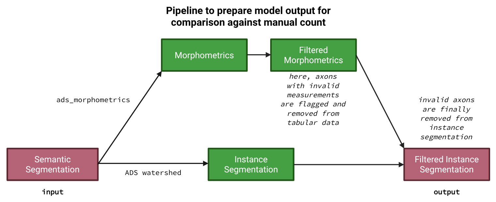

# eval-object-det

Phase 1: Postprocess the semantic segmentations to obtain filtered instance segmentations


Phase 2: Evaluate instance seg against manual count for every image

## Setup the environment
You know the drill: setup a venv to isolate your environment (using `conda`, `pyenv`, ...). For example:

```
conda create python==3.12.9 -n eval-obj-det
conda activate eval-obj-det
conda env update --file environment.yaml
```

This should install AxonDeepSeg so we can use its utilities to postprocess the semantic segmentations.

